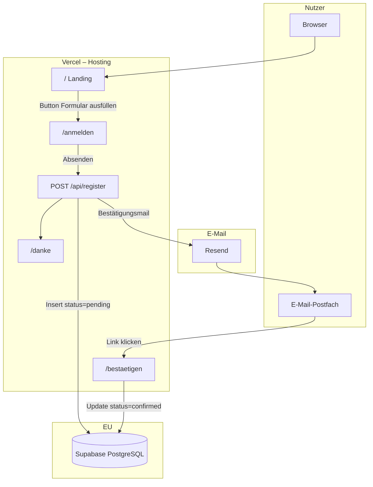
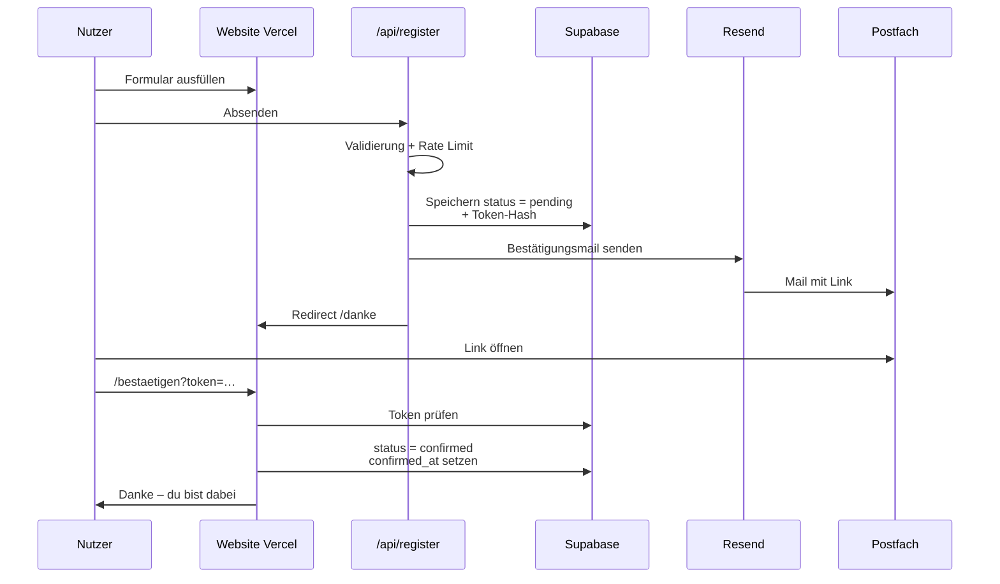
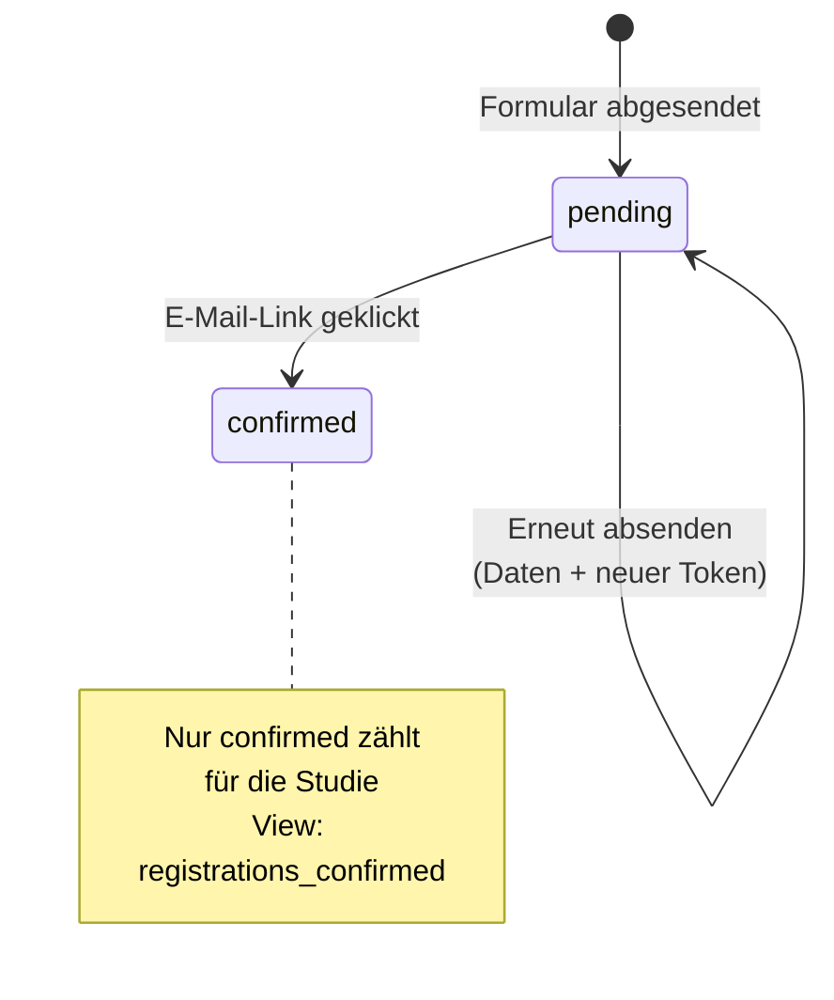

# Wattlokal – Datenfluss

## Übersicht (Architektur)

## Anmeldung im Detail

## Status in der Datenbank

## Kurz in Worten

1. Nutzer öffnet `https://www.wattlokal.de`
2. Klickt auf Formular, füllt Daten aus
3. Server speichert Eintrag als **pending** in Supabase
4. Resend schickt Bestätigungsmail an die angegebene Adresse
5. Nutzer klickt Link → Eintrag wird **confirmed**
6. Erst dann gilt die Anmeldung für die Machbarkeitsstudie

## Beteiligte Dienste

| Dienst | Rolle |
|--------|--------|
| Vercel | Website + API hosten |
| Supabase | Daten speichern (EU) |
| Resend | Bestätigungsmails von `@wattlokal.de` |
| IONOS | Domain `wattlokal.de` (Nameserver → Vercel) |
